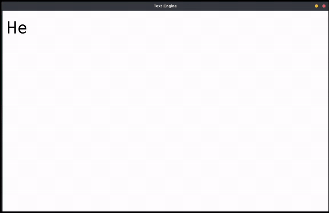

# SDL Text Engine

Inspired by my time in the [Scratch](https://scratch.mit.edu) community.

This is a RPG-Styled text engine where it prints a string character by character.

This is just a header and source file, not a shared library, so you can use it and modify it in your project however you like. I made this for my team's TSA Video Game Design Project which is [here](https://github.com/TSAVideoGame/game).

## Documentation

Documentation can be found on the Wiki (Coming soon)

## Disclaimers

This is still very developmental, so I suggest you don't use this in any of your big projects unless this disclaimer is removed.

This is also not optimized for performance at all, it is just about getting that end result (I will hopefully later come back and try to increase performance)

Code clean up coming soon

## Dependencies
- SDL2
- SDL_ttf

## Upgrades probably not coming
- [ ] Multi-fonts in a message
- [ ] Multi-sizes in a message
- [ ] Multi-colors in a message
- [ ] Ability for some characters to move (do a sine thing)
- [ ] Error checking
- [x] Specific text render times
